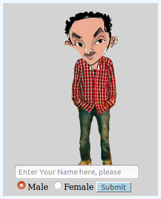
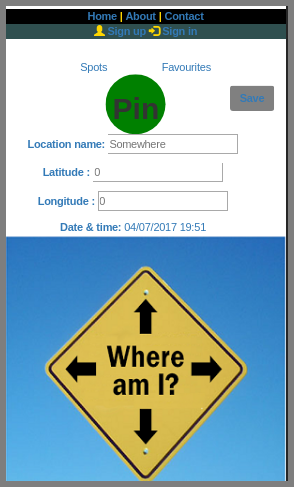
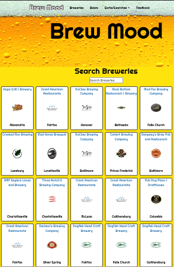
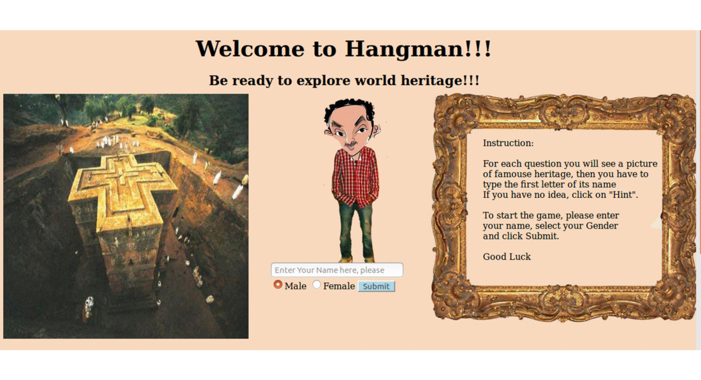
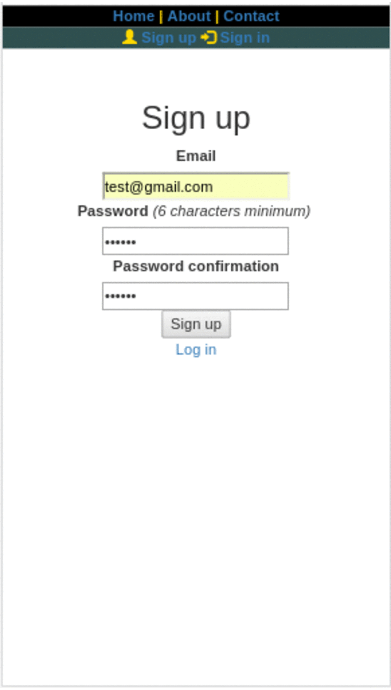
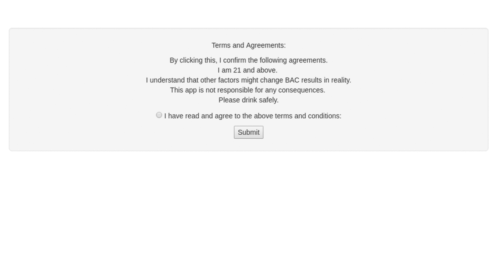

# tedlayea.github.io

<!-- HTML -->
<!-- <Tedla id = "Passion" class = "Full_Stack_Devloper" style = {creativity : "Unique", technology: "fast_learner"}>
  {{team_player}} <%= skilled_and_confident %>
</Tedla> -->

<!-- <Tedla ng-repeat="each in vm.works">
  
{{each.quality}} {{each.creativity}}

</Tedla> -->

<!-- jquery

 $("Tedla").on("apply", accept)
 function accept(){
   $("Tedla").css("status","high_salary")
 } -->

 <h2>Sample Projects</h2>
 

   

     <h3>Hangman</h3>
     

       <input class="hide_radio" ng-model="vm.display" type="radio" name="optionselect" ng-value=1 id="des1">
       <button> <label for="des1">Description</label> </button>
       <input class="hide_radio" ng-model="vm.display" type="radio" name="optionselect" ng-value=11 id="tech1">
       <button> <label for="tech1">Technology</label> </button>
       <input class="hide_radio" ng-model="vm.display" type="radio" name="optionselect" ng-value=111 id="demo1">
       <button> <label for="demo1">Demo</label></button>
       <button> <a href="https://github.com/tedlayea/tedHangman">Source Code</a></button>
     

     

       
 Individual Project   Built in 6 days  Hangman game in which players can spend their time testing their knowledge about world heritage. Depending on the number of errors, different animations will be displayed. 

       
HTML, CSS, JavaScript, and jQuery.

       
     

   

   

     <h3>Tedpark </h3>
     

       <input class="hide_radio" ng-model="vm.display" type="radio" name="optionselect" ng-value=2 id="des2">
       <button> <label for="des2">Description</label> </button>
       <input class="hide_radio" ng-model="vm.display" type="radio" name="optionselect" ng-value=22 id="tech2">
       <button> <label for="tech2">Technology</label> </button>
       <input class="hide_radio" ng-model="vm.display" type="radio" name="optionselect" ng-value=222 id="demo2">
       <button> <label for="demo2">Demo</label></button>
       <button><a href="https://github.com/tedlayea/Tedpark">Source Code</a></button>
     

     

       
 Individual Project   Built in 6 days   A web application that helps you to remember where you parked. It saves the car location and takes you to your car from any other position with just one click. You can see your recent history, and manage your favorite parking spots.

       
 HTML, CSS, JavaScript, jQuery, Bootstrap, ActiveRecord, Ruby on Rails,PostgreSQL and Heroku.

       
     

   

   

     <h3>Brew Mood </h3>
     

       <input class="hide_radio" ng-model="vm.display" type="radio" name="optionselect" ng-value=3 id="des3">
       <button> <label for="des3">Description</label> </button>
       <input class="hide_radio" ng-model="vm.display" type="radio" name="optionselect" ng-value=33 id="tech3">
       <button> <label for="tech3">Technology</label> </button>
       <input class="hide_radio" ng-model="vm.display" type="radio" name="optionselect" ng-value=333 id="demo3">
       <button> <label for="demo3">Demo</label></button>
       <button> <a href="https://github.com/tedlayea/beerApp">Source Code</a></button>
     

     

       
 Group Project   Built in 6 days   A web application that prevents you from driving under the influence by checking your blood alcohol content after you drink, or suggest how much you have to drink in order to be safe. It also recommends you breweries and beer based on your current location, alcohol by volume (abv) and international bitterness unit (IBU).

       
HTML, CSS, JavaScript, jQuery, Ruby on Rails, PostgreSQL, and Angular.js.

       
     

   

   

     <h3>e-Business Card </h3>
     

       <input class="hide_radio" ng-model="vm.display" type="radio" name="optionselect" ng-value=4 id="des4">
       <button> <label for="des4">Description</label> </button>
       <input class="hide_radio" ng-model="vm.display" type="radio" name="optionselect" ng-value=44 id="tech4">
       <button> <label for="tech4">Technology</label> </button>
       <input class="hide_radio" ng-model="vm.display" type="radio" name="optionselect" ng-value=444 id="demo4">
       <button> <label for="demo4">Demo</label></button>
       <button><a href="https://github.com/tedlayea/eBusiness-card">Source Code</a></button>
     

     

       
 Group Project   Built in 6 days   A web application that prevents you from driving under the influence by checking your blood alcohol content after you drink, or suggest how much you have to drink in order to be safe. It also recommends you breweries and beer based on your current location, alcohol by volume (abv) and international bitterness unit (IBU).

       
HTML, CSS, JavaScript, jQuery, Ruby on Rails, PostgreSQL, and Angular.js.

       
     

   

 

 
 
 
 
